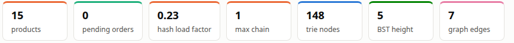
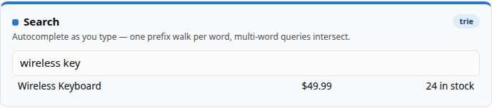
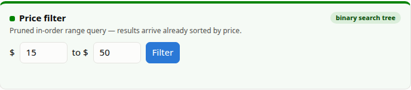
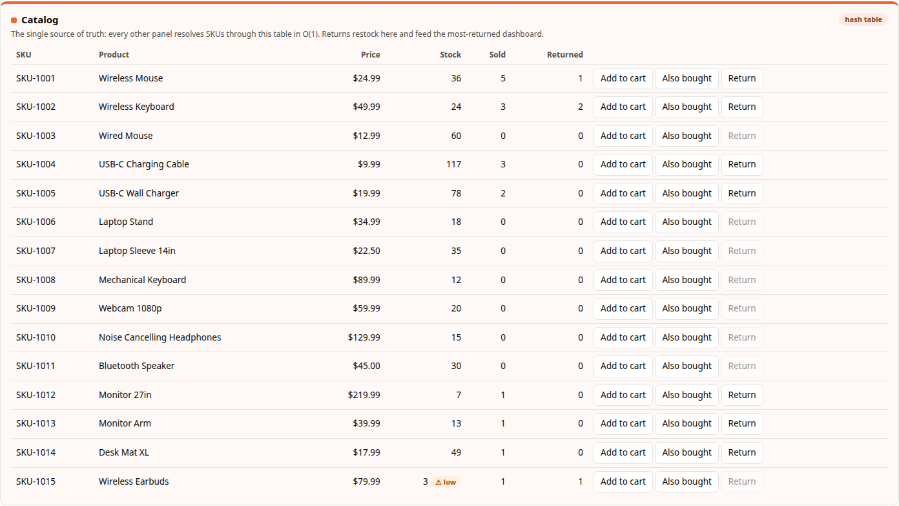
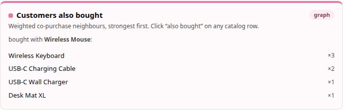
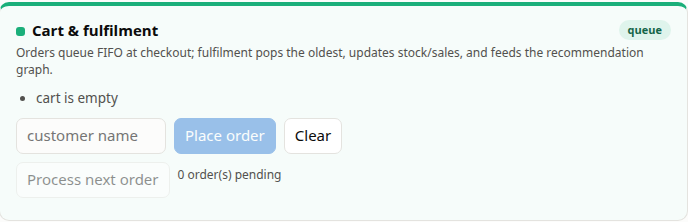
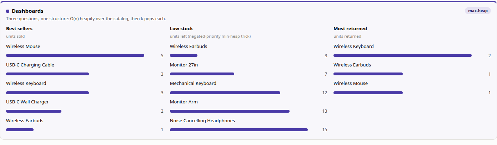
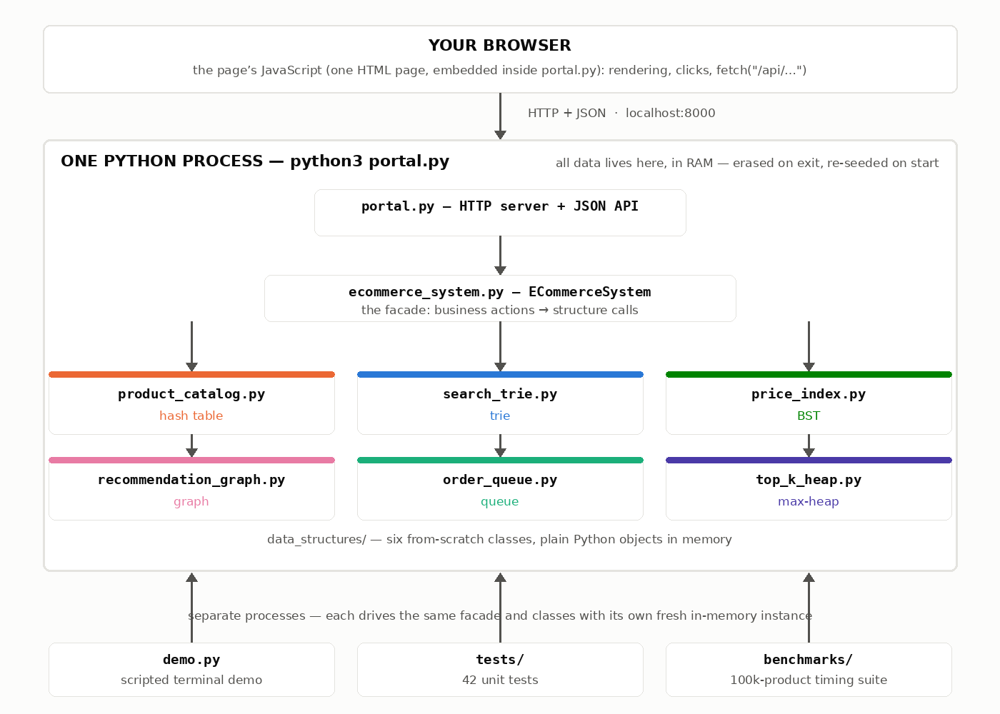

# Reading the Portal — a Panel-by-Panel Guide

**MSCS-532 — Algorithms and Data Structures · Course Project**

The portal (`python3 portal.py` → http://localhost:8000) is not just a storefront
mock-up — it is a **live diagram of the backend**. Every panel on the page is
answered by exactly one of the six from-scratch data structures, every number on
it is read from the real structures at request time, and every color belongs to
one structure. This guide walks the page top to bottom using the actual
screenshots from the running program.

| Color      | Structure          | Answers                           |
| ---------- | ------------------ | --------------------------------- |
| 🔵 Blue    | Trie (prefix tree) | Search / autocomplete             |
| 🟢 Green   | Binary search tree | Price range filter                |
| 🟠 Orange  | Hash table         | Product catalog (source of truth) |
| 🩷 Magenta | Weighted graph     | "Customers also bought"           |
| 🩵 Aqua    | FIFO queue         | Cart & order fulfilment           |
| 🟣 Violet  | Binary max-heap    | All three dashboards              |

> 🎓 **Before the residency:** to refresh the fundamentals of all of these
> data structures in one sitting (the professor may quiz us on the basics
> behind any panel), watch
> ["Every Data Structure Simply Explained in 25 Minutes!"](https://www.youtube.com/watch?v=vVL6NFzr0Rg)
> on YouTube. Then use the "Closest competitor" notes in each section below
> for the "why this structure and not X?" follow-up questions.

---

## 1 · The metrics strip — the structures' vital signs



The seven tiles at the top are **live internal diagnostics**, one glance telling
you whether each structure is healthy. Each tile's colored edge matches the
structure it reports on.

| Tile                 | Value | What it actually measures                                                                                                                                                                                                                                                                       |
| -------------------- | ----- | ----------------------------------------------------------------------------------------------------------------------------------------------------------------------------------------------------------------------------------------------------------------------------------------------- |
| **products**         | 15    | Records stored in the catalog hash table — the single source of truth every other structure resolves into.                                                                                                                                                                                      |
| **pending orders**   | 0     | Orders currently waiting in the FIFO fulfilment queue. Place an order and watch it tick up; process one and it drains.                                                                                                                                                                          |
| **hash load factor** | 0.23  | Records ÷ buckets = 15 / 64. The table doubles its bucket array whenever this passes 0.75, which is what keeps average chains short and lookups O(1).                                                                                                                                           |
| **max chain**        | 1     | The longest collision chain in the table. **1 means every SKU currently sits alone in its bucket** — the FNV-1a hash is spreading keys well. (The benchmarks show this growing to 111 when resizing is disabled at 100k products.)                                                              |
| **trie nodes**       | 148   | Internal nodes in the prefix tree indexing every word of every product name. Shared prefixes are stored once — "Wire**d**" and "Wire**less**" share the `w-i-r-e` path — which is exactly why prefix search is fast.                                                                            |
| **BST height**       | 5     | The deepest path in the price index. For 15 prices a perfectly balanced tree would be ~4 levels; inserting them in catalog (unsorted) order landed at 5 — near-optimal. Had prices arrived sorted, the height would be 15 (a linked-list-shaped tree), the degenerate case the reports discuss. |
| **graph edges**      | 7     | Distinct co-purchase pairs learned from the 8 seeded orders. Each fulfilled multi-item order adds or strengthens edges, so this number grows as the store runs.                                                                                                                                 |

> **Why it matters:** load factor, max chain, and BST height are the three
> numbers that decide whether the "O(1) lookup" and "O(h + m) range query"
> claims actually hold. The portal surfaces them so the health of the theory
> is visible while you use the store.

---

## 2 · Search — the trie 🔵



Typing in this box fires a query **on every keystroke**, and each query is one
walk down the prefix tree: follow one child pointer per typed character, then
collect every SKU stored in the subtree below. Cost is O(length of the prefix +
matches) — it does **not** grow with catalog size, which is why the benchmarks
measured ~1.8 ms against 82 ms for a linear scan (45× at 100k products).

The screenshot shows the clever part: the query **"wireless key"** is two
prefix walks, one per word, and the result is their **intersection**. "wireless"
alone matches the mouse, keyboard, and earbuds; "key" alone matches both
keyboards; only **Wireless Keyboard** survives both filters. The result row is
resolved through the catalog hash table, which is where the price ($49.99) and
stock (24) come from.

**What actually runs** when you type — the facade intersects one trie walk per
word, and each walk is a plain loop over child pointers:

```python
# ecommerce_system.py — search(): one prefix walk per word, then intersect
skus = self.search_index.prefix_search(words[0])
for word in words[1:]:
    matches = set(self.search_index.prefix_search(word))
    skus = [sku for sku in skus if sku in matches]
return [self.catalog.get(sku) for sku in skus[:limit]]
```

```python
# data_structures/search_trie.py — prefix_search(): the walk itself
node = self._root
for ch in prefix:
    if ch not in node.children:
        return []  # dead end: no word starts with this prefix
    node = node.children[ch]
# …then a DFS below `node` collects every SKU in the subtree
```

**Try it live:** type `wire` (matches Wire*d* and Wire*less* products — shared
prefix), then extend to `wireless key` and watch the list narrow.

> **Closest competitor — a sorted word list + binary search** (`bisect`): find
> where the prefix would start in O(log n), then scan forward while words still
> match. Queries are respectable, but every new product means an O(n)
> insert-with-shift, and multi-word intersection needs extra bookkeeping the
> trie gets for free. A hash table isn't even in the running here: hashing
> scatters keys on purpose, destroying exactly the prefix locality search
> needs.

---

## 3 · Price filter — the binary search tree 🟢



The price index keeps every product keyed by price in a BST, so the question
"everything between $15 and $50" is answered by a **pruned in-order
traversal**: subtrees that lie wholly outside the range are never visited, and
the in-order walk emits survivors **already sorted by price** — no re-sorting
step exists anywhere. Cost is O(tree height + matches), and the benchmark
measured the pruning beating a full scan 5.7× on a ~5% price window.

**What actually runs** when you click Filter — an in-order traversal with the
two pruning rules doing the work (trimmed to its core):

```python
# data_structures/price_index.py — range_query(low, high)
while stack or node is not None:
    while node is not None:
        stack.append(node)
        # prune 1: the left subtree only matters while price > low
        node = node.left if node.price > low else None
    node = stack.pop()               # next node in ascending price order
    if low <= node.price <= high:
        results.extend(sorted(node.skus))
    if node.price > high:
        break                        # prune 2: everything after is larger
    node = node.right
```

**Try it live:** run the default $15–$50 filter and check the result list is
ascending by price; then narrow to $15–$25 and watch the result set shrink
without the query getting slower.

> **Closest competitor — a sorted array + binary search:** two `bisect` calls
> find the range bounds in O(log n) and the slice is already sorted — genuinely
> hard to beat for queries. It loses on writes: every price insert or delete
> shifts elements, O(n), while the BST does both in O(h). (The industrial
> version of this trade is the B-tree, which is what real database indexes
> use.)

---

## 4 · Catalog — the hash table 🟠



This table **is** the store: SKU → product record, hashed with a hand-rolled
FNV-1a function into 64 buckets with separate chaining. Every other panel
stores only SKU strings and resolves them here in O(1) — that single-source-
of-truth rule is why the Sold column here, the best-seller bars below, and the
search results can never disagree with each other.

Reading the columns:

- **Stock** falls when fulfilment commits an order and rises when a return is
  accepted. The amber **⚠ low** badge appears at ≤ 5 units (see Wireless
  Earbuds: 3 left) — the same signal the low-stock dashboard ranks.
- **Sold** counts fulfilled units. It is incremented only by the fulfilment
  step, never by checkout — an order sitting in the queue hasn't sold anything.
- **Returned** counts units that came back. The **Return** button is grayed
  out whenever a product has no returnable units — either nothing has sold
  yet (Sold = 0), or every sold unit has already come back (Returned = Sold).
  The backend enforces the same rule: `process_return` caps *cumulative*
  returns at units actually sold, so the same unit can never be returned
  twice. Hover a grayed button and the tooltip says why.

**What actually runs** on every SKU resolve — hash the key to one bucket, scan
its (short) chain:

```python
# data_structures/product_catalog.py — FNV-1a: SKU string -> bucket index
h = self._FNV_OFFSET
for byte in key.encode("utf-8"):
    h ^= byte                       # mix the byte into the state
    h = (h * self._FNV_PRIME) & 0xFFFFFFFFFFFFFFFF
return h % len(self._buckets)
```

```python
# get(): O(1) because the chain is kept short by resizing
for product in self._buckets[self._hash(sku)]:
    if product.sku == sku:
        return product
raise KeyError(f"unknown SKU: {sku}")
```

**Try it live:** click **Return** on Wireless Keyboard and watch three things
move at once: its Stock +1 and Returned +1 here, and its bar grow in the
"Most returned" dashboard — one write, one source of truth, every view agrees.

> **Closest competitor — a balanced BST (e.g., red-black tree):** guaranteed
> O(log n) for everything plus sorted iteration as a bonus. But SKU lookup
> never needs order — "give me SKU-1007" has no notion of "the next SKU" —
> so paying log n per lookup buys nothing here, and the hash table's expected
> O(1) wins. (Within hash tables, the design competitor is open addressing
> vs. our separate chaining; chaining was chosen for graceful degradation and
> trivial deletes.)

---

## 5 · Customers also bought — the weighted graph 🩷



Every time an order with multiple items is fulfilled, the recommendation graph
adds (or strengthens) an edge between each pair of SKUs in it. The panel shows
the **neighbours of one product, sorted by edge weight** — and the weight is
literally "how many orders contained both."

The screenshot explains the seeded numbers: Wireless Keyboard shows **×3**
because three of the demo orders (alice, carol, erin) contained mouse +
keyboard together; the USB-C cable's **×2** comes from bob and grace. This is
the core integration claim of the project made visible: **commerce feeds the
graph, the graph improves recommendations, immediately**.

**What actually runs** — fulfilment writes every pair in the order into the
graph, and the panel reads neighbours back sorted by weight:

```python
# data_structures/recommendation_graph.py — record_order(): all pairs
unique = list(dict.fromkeys(skus))
for i in range(len(unique)):
    for j in range(i + 1, len(unique)):
        self.add_copurchase(unique[i], unique[j])   # edge weight += 1
```

```python
# also_bought(): neighbours of one SKU, strongest first
ranked = sorted(neighbours.items(), key=lambda kv: (-kv[1], kv[0]))
return ranked[:k]
```

**Try it live:** put two never-paired products in the cart (say the Webcam and
the Monitor Arm), place and process the order, then click "Also bought" on the
Webcam — the new edge is already there, with weight ×1.

> **Closest competitor — an adjacency matrix:** a V×V grid where cell (i, j)
> holds the co-purchase count. Edge lookups become O(1), but memory is O(V²)
> whether edges exist or not — at 100,000 products that is 10 billion cells
> for a graph where almost every pair has never been bought together.
> Co-purchase data is extremely sparse, so the adjacency list (store only the
> edges that exist) is the right shape.

---

## 6 · Cart & fulfilment — the FIFO queue 🩵



Checkout and fulfilment are deliberately **two separate moments**, and the
queue between them is a circular-buffer FIFO:

1. **Place order** validates that every SKU exists (an unknown SKU is rejected
   here, before it ever enters the queue) and enqueues. Stock is *not* touched
   yet — it can change while the order waits.
2. **Process next order** dequeues the *oldest* order (FIFO fairness) and runs
   a strict **validate-then-commit**: every line item is checked against stock
   *before anything is mutated*. If any item falls short the whole order fails
   atomically — no partial stock decrements, verified by the unit tests.
3. Only on success: stock down, sales up, and the order's item pairs are fed
   to the recommendation graph.

The pending counter here and the "pending orders" tile at the top are the same
number — the queue's length, read live.

**What actually runs** — the circular buffer moves indexes, never data, and
fulfilment is validate-then-commit:

```python
# data_structures/order_queue.py — nothing shifts, indexes wrap
tail = (self._head + self._size) % len(self._buffer)    # enqueue at back
self._buffer[tail] = order
...
order = self._buffer[self._head]                        # dequeue oldest
self._head = (self._head + 1) % len(self._buffer)
```

```python
# ecommerce_system.py — process_next_order(): check ALL before touching ANY
for product in products:
    if product.stock < order.skus.count(product.sku):
        order.status = "failed"
        raise OutOfStockError(...)      # atomic: nothing was mutated
for product in products:                # all checks passed — commit
    product.stock -= 1
    product.sales_count += 1
self.recommendations.record_order(order.skus)   # feed the graph
```

**Try it live:** add three products to the cart, place the order, watch
"pending" go to 1 — then process it and watch stock, Sold, best sellers, and
the graph edge count all update from that single commit.

> **Closest competitor — a linked-list queue:** also O(1) at both ends, and it
> never needs the circular buffer's occasional resize. The cost is one node
> object and one pointer per order — more memory, worse cache behaviour than
> a contiguous array. (The naive competitor, a plain Python list with
> `pop(0)`, is quietly O(n) per dequeue because every remaining element
> shifts left — the exact trap the circular buffer's wrap-around indexing
> avoids.)

---

## 7 · Dashboards — the max-heap 🟣



Three different business questions, **one data structure**. Each list is built
the same way: heapify the whole catalog bottom-up — O(n), cheaper than
sorting — then pop just the top k at O(log n) each. Total O(n + k log n) for
"top 5 of everything," without maintaining any standing index.

- **Best sellers** ranks on `sales_count` (Wireless Mouse leads with 5 —
  it appeared in five fulfilled orders).
- **Low stock** wants the *smallest* values from a *max*-heap, so priorities
  are pushed **negated** — the classic min-heap trick — and un-negated for
  display. Wireless Earbuds surfaces first with 3 left, agreeing with the ⚠
  badge in the catalog.
- **Most returned** ranks on `returns_count` (keyboard: 2). It is deliberately
  independent of Sold: **best sellers measures demand, most returned measures
  dissatisfaction**, and a product ranking high on both is exactly what a
  merchandiser needs to notice. A return puts the unit back into stock but
  never subtracts from Sold, keeping the two signals clean.

**What actually runs** — three one-liners in the facade, one heap class
underneath:

```python
# ecommerce_system.py — same structure, three different priorities
heap = TopKHeap((p.sales_count, p.sku) for p in self.catalog)    # best sellers
heap = TopKHeap((-p.stock, p.sku) for p in self.catalog)         # low stock
heap = TopKHeap((p.returns_count, p.sku) for p in self.catalog)  # most returned
```

```python
# data_structures/top_k_heap.py — O(n) bottom-up build: sift only the
# internal nodes, leaves are already valid heaps
for idx in range(len(self._heap) // 2 - 1, -1, -1):
    self._sift_down(idx)
```

**Try it live:** every bar here is recomputed from the live catalog after each
order or return — fulfil an order containing the USB-C Wall Charger twice and
watch it climb the best-seller list.

> **Closest competitor — just sort everything:** `sorted()` over the catalog
> and take the first five, O(n log n). For top-k with tiny k the heap is
> asymptotically better at O(n + k log n) — heapify is linear and you only
> pay log n for the five entries you actually pop. (The reports tell the
> honest benchmark story: Python's C-implemented sort is fast enough that the
> asymptotic win only becomes decisive as n grows — which is itself a good
> lesson about constants vs. complexity.)

---

## 8 · The code — every file, how they connect, where they run

**Is it one file? No — it is nine Python files working together**, split so
each data structure lives alone in its own module. The portal you click is the
top of a three-layer chain: the browser page talks to `portal.py`, `portal.py`
calls the facade in `ecommerce_system.py`, and the facade drives the six
structure classes in `data_structures/` — all inside **one** Python process.
Everything is plain **Python 3 stdlib (zero pip installs)**; even the HTML/JS
page is a string embedded inside `portal.py`.



The complete file map:

```
residency/
├── portal.py                    ★ the web portal (what this guide describes)
│                                  serves the page + a JSON API on port 8000
├── demo.py                        scripted terminal demo; ALSO owns the seed
│                                  data (CATALOG, ORDERS) that portal.py reuses
├── ecommerce_system.py          ★ the FACADE — every business action
│                                  (add_product, search, place_order,
│                                  process_return, best_sellers …) fans out
│                                  to the right structures underneath
├── data_structures/               the six from-scratch implementations
│   ├── __init__.py                exports the six classes below
│   ├── product_catalog.py         🟠 Product + ProductCatalog   (hash table)
│   ├── search_trie.py             🔵 SearchTrie                 (prefix tree)
│   ├── price_index.py             🟢 PriceIndex                 (BST)
│   ├── recommendation_graph.py    🩷 RecommendationGraph        (adjacency list)
│   ├── top_k_heap.py              🟣 TopKHeap                   (binary max-heap)
│   └── order_queue.py             🩵 Order + OrderQueue         (circular FIFO)
├── tests/
│   └── test_data_structures.py    42 unit tests over all of the above
├── benchmarks/
│   ├── generate_dataset.py        builds the 100k-product benchmark catalog
│   ├── benchmark.py               the timing suite (~3 min)
│   └── benchmark_data.json        results consumed by the report charts
├── charts/                        benchmark charts used in the reports
├── screenshots/                   real captures (all images in this guide)
├── deliverables/                  the four report/presentation folders
├── README.md                      project overview + how to run everything
└── PORTAL_GUIDE.md                this guide
```

**How they import each other** — one straight chain, no cycles: `portal.py`
imports `demo.py` (for the seed data only) and `ecommerce_system.py`; the
facade imports the six classes from `data_structures/`; no structure ever
imports another structure — only the facade knows they all exist.

**Which code runs where:**

| Code                                         | Runs in                | Started by                              | Talks to                                      |
| -------------------------------------------- | ---------------------- | --------------------------------------- | --------------------------------------------- |
| Page HTML/JS (embedded in `portal.py`)       | your **browser**       | opening http://localhost:8000           | the API via `fetch()`                         |
| `portal.py` server + facade + six structures | one **Python process** | `python3 portal.py`                     | nothing external — data is objects in its RAM |
| `demo.py`                                    | its own Python process | `python3 demo.py`                       | same classes, fresh instance                  |
| `tests/`                                     | its own Python process | `python3 -m unittest discover -s tests` | same classes, fresh instances per test        |
| `benchmarks/`                                | its own Python process | `python3 benchmarks/benchmark.py`       | same classes at 100k-product scale            |

And this is the entire trick that connects the two worlds — one `fetch` in the
browser, one route in the server, one facade call:

```js
// browser side (the page's JS): every keystroke asks the backend
$("search-box").addEventListener("input", async e => {
  const q = e.target.value.trim();
  productRows(q ? await api("/api/search?q=" + encodeURIComponent(q)) : [],
              $("search-results"));
});
```

```python
# portal.py (server side): the route is nothing but a facade call
elif url.path == "/api/search":
    query = q.get("q", [""])[0]
    self._send(200, [product_json(p) for p in self.shop.search(query)])
```

Two consequences worth saying out loud: the browser never touches a data
structure directly — every panel goes through the facade's API, which is what
keeps the single-source-of-truth rule intact; and because each entry point
builds its own in-memory instance, the portal, demo, tests, and benchmarks can
never corrupt each other — and stopping the portal erases its session, which
re-seeds identically on the next launch (see the README for why that is a
feature for a live demo).

---

## How the page stays consistent

There is no client-side state to drift out of sync: after **every** mutation
(order placed, order processed, return accepted) the page refetches the
catalog, the dashboards, and the stats strip from the backend. The browser
mirrors the backend's own integration rule — *data lives in exactly one place,
everything else resolves it* — so what you see is always what the structures
contain.

Full-page captures live in `screenshots/screenshot_portal_page.png` (fresh
load) and `screenshots/screenshot_portal_search.png` (the state shown
throughout this guide: search `wireless key` + recommendations for
`SKU-1001`); the panel crops above are cut from the latter by
`generate_screenshots_project.py`.
